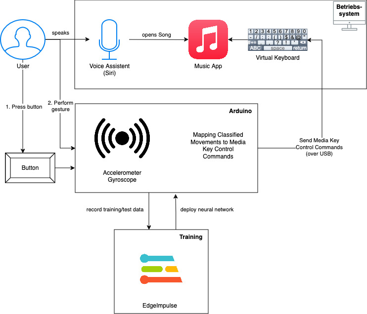

# Motion-Controlled Media Device Documentation

## Overview

This project introduces a novel approach to media control through motion gestures, utilizing an Arduino Nano 33 BLE. Designed for simplicity and efficiency, the device translates specific hand movements into media control actions such as play, pause, volume adjustment, and track navigation. Integrated onto a glove for ease of use and mobility, it leverages machine learning with Edge Impulse to recognize gestures with high accuracy.

## Process

The user first needs to start a music app on their device. Either via Voice Commands or by opening the app manually.
As soon as the music app is running and the MusicGlove is connected, the user can start the MusicGlover by pressing the button on the glove.
The MusicGlover will then start to recognize the user's gestures and send the corresponding commands to the music app.

## Features

- **Gesture Recognition**: Utilizes a neural network to interpret hand gestures for media control.
- **Supported Actions**: Includes Forward, Backward, Skip, Play/Pause, Increase Volume, Decrease Volume, and Mute/Unmute.
- **Hardware Design**: Compact form factor with the chipset mounted on a glove and a button to activate the measuring process.
- **Connectivity**: Wired connection to a computer via a long Micro-USB cable.
- **Software Stack**: Developed with Arduino IDE, leveraging C and C++ for the firmware.

## Hardware Requirements

- Arduino Nano 33 BLE
- TinyML Shield for Arduino Nano 33 BLE
- A glove to mount the chipset
- A button switch
- Micro-USB cable for connection to device
- Jumper wires for button

## Software Requirements

- Arduino IDE
- Edge Impulse Studio (for gesture training and model generation)

## Installation

1. **Firmware Setup**:
   - Download or clone the project repository.
   - Ensure the Arduino IDE is installed on your computer.
   - Open the project in the Arduino IDE.

2. **Model Deployment**:
   - Train your model using Edge Impulse with the gestures you intend to recognize.
   - Export the trained model and integrate it into your Arduino project.

3. **Hardware Assembly**:
   - Attach the Arduino Nano 33 BLE to the back of the glove.
   - Connect the button to the designated pins on the Nano.
   - Ensure the Micro-USB cable and jumper wires are securely connected to the Nano and your computer.

4. **Flashing the Firmware**:
   - Connect the Arduino Nano 33 BLE to your computer.
   - Use the Arduino IDE to compile and upload the firmware to the chipset.

5. **Final Setup**:
   - Ensure the target media device is connected and recognized by your computer.
   - No further software setup is required after the initial installation.

## Usage

1. **Starting the Device**:
   - Press the button on the glove to activate the gesture recognition mode.

2. **Performing Gestures**:
   - Perform the trained gestures to control media playback. The neural network will interpret your movements and map them to predefined media actions.

3. **Media Control**:
   - Actions like Play/Pause, Skip, Volume Adjustment, and Mute/Unmute will be executed on the connected media device based on the recognized gestures.

## Troubleshooting

- **Device Not Recognized**: Check the Micro-USB connection and ensure the Arduino Nano is powered on.
- **Gesture Not Recognized**: Recalibrate the gesture model in Edge Impulse and ensure the gestures are distinct and well-trained.

## Contributing

Contributions to the project are welcome. Please follow the standard fork and pull request workflow. For major changes, please open an issue first to discuss what you would like to change.

## License

[MIT License](https://opensource.org/licenses/MIT) - This project is open-sourced under the MIT license.
