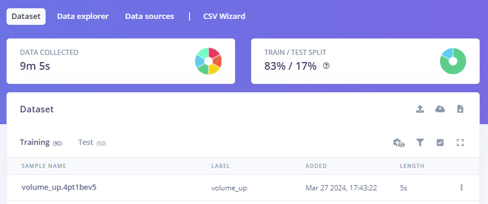

# MusicGlover - A Motion-Controlled Media Device

## Overview

This project introduces a novel approach to media control through motion gestures, utilizing an Arduino Nano 33 BLE. Designed for simplicity and efficiency, the device translates specific hand movements into media control actions such as play, pause, volume adjustment, and track navigation. Integrated onto a glove for ease of use and mobility, it leverages machine learning with Edge Impulse to recognize gestures with high accuracy.

### File structure
- **assets:** All images used in the README.md
- **edge_impulse_export:** Exported EdgeImpulse MachineLearning Model as Arduino-Export
- **libraries:** All libraries used by the sketch
- **sketch:** Sketch that uses the Model and adds behavior (programm/script for the arduino)
- **presentation:** Our MusicGlover-Pitch and our final presentation 

## Process

The user first needs to start a music app on their device. Either via Voice Commands or by opening the app manually.
As soon as the music app is running and the MusicGlove is connected, the user can start the MusicGlover by pressing the button on the glove.
The MusicGlover will then start to recognize the user's gestures and send the corresponding commands to the music app.

## Features

- **Gesture Recognition**: Utilizes a neural network to interpret hand gestures for media control.
- **Supported Actions**: Includes Forward, Backward, Skip, Play/Pause, Increase Volume, Decrease Volume, and Mute/Unmute.
- **Hardware Design**: Compact form factor with the chipset mounted on a glove and a button to activate the measuring process.
- **Connectivity**: Wired connection to a computer via a long Micro-USB cable.
- **Software Stack**: Developed with Arduino IDE, leveraging C and C++ for the firmware.

## Hardware Requirements

- Arduino Nano 33 BLE
- TinyML Shield for Arduino Nano 33 BLE
- A glove to mount the chipset
- A button switch
- Micro-USB cable for connection to device
- Jumper wires for button

## Software Requirements

Suites:
- Arduino IDE
- Edge Impulse Studio (for gesture training and model generation)

Operating System:
- Arduino Mbed OS Nano Boards: 4.1.1

Libraries:
- <USBKeyboard.h>
- <PluggableUSBHID.h>
- <Arduino_LSM9DS1.h>
- <Arduino_LPS22HB.h>  
- <Arduino_HTS221.h> 
- <Arduino_APDS9960.h>

## Installation

1. **Repository Setup**:
   - Download or clone the project repository.
   - Ensure the Arduino IDE is installed on your computer.
   - Open the project in the Arduino IDE.

2. **Install OS and Libraries**:
   - Select Tools -> Board -> Boards Manager. Search for "Arduino Mbed OS Nano Boards" and install.
   - Select the newly installed Board from Tools -> Board -> Arduino Mbed OS Nano Boards -> Arduino Nano 33 BLE
   - Install the necessary Arduino libraries from the Library Manager.
   - Import the included zip from the library folder into the Arduino IDE by choosing Sketch -> Include Library -> Add Zip and select it in the file browser.

4. **Hardware Assembly**:
   - Attach the Arduino Nano 33 BLE to the back of the glove.
   - Connect the button to the designated pins on the Nano.
   - Ensure the Micro-USB cable and jumper wires are securely connected to the Nano and your computer.

5. **Flashing the Firmware**:
   - Connect the Arduino Nano 33 BLE to your computer.
   - Use the Arduino IDE to compile and upload the firmware to the chipset.

6. **Final Setup**:
   - Ensure the Arduino device is connected and recognized by your computer.
   - No further software setup is required after the initial installation.

## Usage

1. **Starting the Device**:
   - Press the button on the glove to activate the gesture recognition mode.

2. **Performing Gestures**:
   - Perform the trained gestures to control media playback. The neural network will interpret your movements and map them to predefined media actions.

3. **Media Control**:
   - Actions like Play/Pause, Skip, Volume Adjustment, and Mute/Unmute will be executed on the connected media device based on the recognized gestures.

## Edge Impulse/Machine Learning Model
Edge Impulse provides an innovative platform for developing machine learning models tailored for edge devices. In this project, we leverage Edge Impulse to design and train a model for recognizing specific hand gestures, based on data recorded with Edge Impulse through a combination of sensors. This model is then optimized and exported for deployment, allowing for real-time gesture recognition in various applications. 

**Data Preparation and Split**

For the purpose of training a model to detect hand gestures, we collected a dataset comprising 90 training sets and 50 test sets, achieving an approximate 83% training to 17% test data split. The training data, totaling 9 minutes and 5 seconds, consists of 5-second recordings for each instance. These recordings are labeled with six distinct gestures: mute/unmute, next, play/pause, previous, volume down, and volume up, each representing a specific hand motion. The test data varies in length from 1 to 5 seconds, providing a varied range for model validation.

**Model Features and Impulse Design**

The model utilizes data from magnetometer, accelerometer, and gyroscope sensors, focusing on the axes accX, accY, accZ, gyrX, gyrY, gyrZ, magX, magY, magZ. Spectral analysis of these axes forms the basis of our feature extraction, with a 2500ms window size for data processing and a 100ms window increase. This technique ensures comprehensive feature extraction over varying lengths of recordings. The extracted features, obtained through spectral analysis, feed into a neural network comprising an input layer with 54 features, followed by two dense layers with 20 and 10 neurons, respectively, and an output layer corresponding to the six gesture classes.

**Accuracy and Clustering**

The model demonstrates a remarkable accuracy of 99.8% in correctly classifying the gestures, with a minimal loss of 0.01. This high level of accuracy, achieved over 30 training cycles and a learning rate of 0.0005, underscores the model's efficiency in distinguishing between the different gestures. The architecture's design allows for clear separation of the six classes in clustering analysis, further evidencing the model's precision. Edge Impulse's performance metrics for on-device deployment indicate an inferencing time of 1ms, with peak RAM usage at 1.4K and flash usage at 16.3K, showcasing the model's suitability for real-time applications on edge devices.

## Troubleshooting

- **Device Not Recognized**: Check the Micro-USB connection and ensure the Arduino Nano is powered on.
- **Gesture Not Recognized**: Recalibrate the gesture model in Edge Impulse and ensure the gestures are distinct and well-trained.

## Sources

- https://www.hackster.io/textzip/gesture-based-media-control-using-nano-33-ble-sense-1420fd
- https://community.alexgyver.ru/threads/ispolzovanie-nano-33-ble-v-kachestve-hid-devajsa-besprovodnoj-klaviatury-nuzhna-pomosch.8110/
- https://docs.arduino.cc/hardware/nano-33-ble/
- https://forum.arduino.cc/t/mbed-ble-hid-send-keyboard-pgup-and-pgdn/1045693
- https://edge-impulse.gitbook.io/docs
- https://hwrberlin.github.io/tinyml/ml-mini-project.html
- https://github.com/witnessmenow/arduino-switcheroonie/blob/master/switcheroonie/switcheroonie.ino
- https://github.com/T-vK/ESP32-BLE-Keyboard
- https://github.com/jpconstantineau/BlueMicro_BLE?tab=readme-ov-file
- https://github.com/bitbank2/BLE_Keyboard/blob/master/BLE_Keyboard.ino
- https://github.com/tcoppex/mbed-ble-hid/blob/master/examples/ble_shining_kb/ble_shining_kb.ino
- https://gist.github.com/NeoCat/b709cdd9899386bf956b01df084c4d7a

## Contributing

Contributions to the project are welcome. Please follow the standard fork and pull request workflow. For major changes, please open an issue first to discuss what you would like to change.

## License

[MIT License](https://opensource.org/licenses/MIT) - This project is open-sourced under the MIT license.
